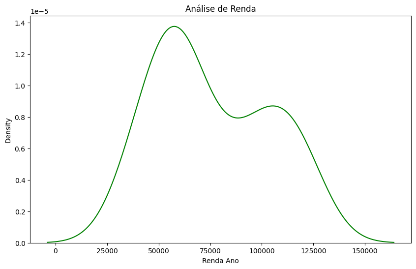
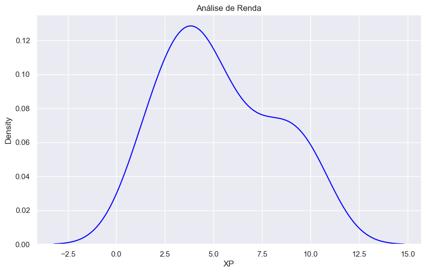
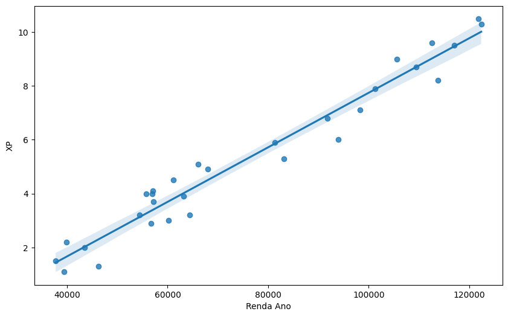

```python
# Libs Necessárias

# Libs para Modelagem e Matrizez
import numpy as np
import pandas as pd

# Libs para anaálises gráficas
import matplotlib.pyplot as plt
import seaborn as sns
```


```python
# Importando base de dados
dados = pd.read_csv("Salary_Data.csv")

# Verificando a base
dados.head()
```


<div>
<style scoped>
    .dataframe tbody tr th:only-of-type {
        vertical-align: middle;
    }

    .dataframe tbody tr th {
        vertical-align: top;
    }

    .dataframe thead th {
        text-align: right;
    }
</style>
<table border="1" class="dataframe">
  <thead>
    <tr style="text-align: right;">
      <th></th>
      <th>YearsExperience</th>
      <th>Salary</th>
    </tr>
  </thead>
  <tbody>
    <tr>
      <th>0</th>
      <td>1.1</td>
      <td>39343.0</td>
    </tr>
    <tr>
      <th>1</th>
      <td>1.3</td>
      <td>46205.0</td>
    </tr>
    <tr>
      <th>2</th>
      <td>1.5</td>
      <td>37731.0</td>
    </tr>
    <tr>
      <th>3</th>
      <td>2.0</td>
      <td>43525.0</td>
    </tr>
    <tr>
      <th>4</th>
      <td>2.2</td>
      <td>39891.0</td>
    </tr>
  </tbody>
</table>
</div>


```python
# Renomeando as Colunas
dados.rename( columns={
    'YearsExperience' : 'XP',
    'Salary' : 'Renda Ano'
}, inplace=True)
```


```python
# Criando nova coluna com Renda Mensal
dados['Renda Mes'] = dados['Renda Ano'] / 12
```


```python
dados.head()
```


<div>
<style scoped>
    .dataframe tbody tr th:only-of-type {
        vertical-align: middle;
    }

    .dataframe tbody tr th {
        vertical-align: top;
    }

    .dataframe thead th {
        text-align: right;
    }
</style>
<table border="1" class="dataframe">
  <thead>
    <tr style="text-align: right;">
      <th></th>
      <th>XP</th>
      <th>Renda Ano</th>
      <th>Renda Mes</th>
    </tr>
  </thead>
  <tbody>
    <tr>
      <th>0</th>
      <td>1.1</td>
      <td>39343.0</td>
      <td>3278.583333</td>
    </tr>
    <tr>
      <th>1</th>
      <td>1.3</td>
      <td>46205.0</td>
      <td>3850.416667</td>
    </tr>
    <tr>
      <th>2</th>
      <td>1.5</td>
      <td>37731.0</td>
      <td>3144.250000</td>
    </tr>
    <tr>
      <th>3</th>
      <td>2.0</td>
      <td>43525.0</td>
      <td>3627.083333</td>
    </tr>
    <tr>
      <th>4</th>
      <td>2.2</td>
      <td>39891.0</td>
      <td>3324.250000</td>
    </tr>
  </tbody>
</table>
</div>


```python
# Dimensão
dados.shape
```


    (30, 3)


```python
# Verificando se existe algum dado nulo
dados.isnull().sum()
```


    XP           0
    Renda Ano    0
    Renda Mes    0
    dtype: int64


```python
dados.describe()
```


<div>
<style scoped>
    .dataframe tbody tr th:only-of-type {
        vertical-align: middle;
    }

    .dataframe tbody tr th {
        vertical-align: top;
    }

    .dataframe thead th {
        text-align: right;
    }
</style>
<table border="1" class="dataframe">
  <thead>
    <tr style="text-align: right;">
      <th></th>
      <th>XP</th>
      <th>Renda Ano</th>
      <th>Renda Mes</th>
    </tr>
  </thead>
  <tbody>
    <tr>
      <th>count</th>
      <td>30.000000</td>
      <td>30.000000</td>
      <td>30.000000</td>
    </tr>
    <tr>
      <th>mean</th>
      <td>5.313333</td>
      <td>76003.000000</td>
      <td>6333.583333</td>
    </tr>
    <tr>
      <th>std</th>
      <td>2.837888</td>
      <td>27414.429785</td>
      <td>2284.535815</td>
    </tr>
    <tr>
      <th>min</th>
      <td>1.100000</td>
      <td>37731.000000</td>
      <td>3144.250000</td>
    </tr>
    <tr>
      <th>25%</th>
      <td>3.200000</td>
      <td>56720.750000</td>
      <td>4726.729167</td>
    </tr>
    <tr>
      <th>50%</th>
      <td>4.700000</td>
      <td>65237.000000</td>
      <td>5436.416667</td>
    </tr>
    <tr>
      <th>75%</th>
      <td>7.700000</td>
      <td>100544.750000</td>
      <td>8378.729167</td>
    </tr>
    <tr>
      <th>max</th>
      <td>10.500000</td>
      <td>122391.000000</td>
      <td>10199.250000</td>
    </tr>
  </tbody>
</table>
</div>


```python
#O menor valor observado para a variável "experiência" é de 1,1 anos, enquanto o maior valor observado é de 10,5 anos.
#A renda anual mínima observada é de R$ 37.731,00, enquanto a renda anual máxima é de R$ 122.391,00.
#A renda mensal mínima observada é de R$ 3.144,25, enquanto a renda mensal máxima é de R$ 10.199,25.

#A média de "experiência" é de 5,31 anos. Isso indica que, em média, as pessoas possuem uma experiência de trabalho de cerca de 5 anos e 4 meses.
#A média da variável "Renda Ano" é de aproximadamente 76.003. Isso indica que, em média, as pessoas têm uma renda anual de cerca de R$ 76.003,00.
#A média da variável "Renda Mês" é de aproximadamente 6.333,58. Isso sugere que, em média, as pessoas têm uma renda mensal de cerca de R$ 6.333,58.

#O desvio padrão da "experiência" é de aproximadamente 2,84. Isso indica que a dispersão dos dados em relação à média é relativamente baixa, isso indica que a experiência de trabalho das pessoas varia pouco em relação à média.
#O desvio padrão da variável "Renda Ano" e "Renda Mês" é respectivamente R$ 27.414,43 e R$ 2.284,54. Isso indica que a dispersão dos dados em relação à média é relativamente alta, sugerindo que as rendas anuais das pessoas variam consideravelmente em relação à média.

#Avaliando os quartis da variável "experiência", indica que 25% das pessoas têm uma experiência de trabalho inferior a 3,2 anos, 50% têm uma experiência inferior a 4,7 anos e 75% têm uma experiência inferior a 7,7 anos.
```


```python
# Correlação

dados.corr()
```


<div>
<style scoped>
    .dataframe tbody tr th:only-of-type {
        vertical-align: middle;
    }

    .dataframe tbody tr th {
        vertical-align: top;
    }

    .dataframe thead th {
        text-align: right;
    }
</style>
<table border="1" class="dataframe">
  <thead>
    <tr style="text-align: right;">
      <th></th>
      <th>XP</th>
      <th>Renda Ano</th>
      <th>Renda Mes</th>
    </tr>
  </thead>
  <tbody>
    <tr>
      <th>XP</th>
      <td>1.000000</td>
      <td>0.978242</td>
      <td>0.978242</td>
    </tr>
    <tr>
      <th>Renda Ano</th>
      <td>0.978242</td>
      <td>1.000000</td>
      <td>1.000000</td>
    </tr>
    <tr>
      <th>Renda Mes</th>
      <td>0.978242</td>
      <td>1.000000</td>
      <td>1.000000</td>
    </tr>
  </tbody>
</table>
</div>


```python
# Gráfico para Análise de Renda

plt.figure(figsize=(10, 6))
plt.title('Análise de Renda')
sns.kdeplot(dados['Renda Ano'], color='green');
```


    

    


```python
# Gráfico para Análise de Experiência

plt.figure(figsize=(10, 6))
plt.title('Análise de Renda')
sns.kdeplot(dados['XP'] , color='blue');
```


    

    


```python
plt.figure(figsize=(10, 6))
sns.regplot(data=dados, x='Renda Ano', y='XP')
```


    <Axes: xlabel='Renda Ano', ylabel='XP'>


    

    


```python
# O gráfico mostra uma relação linear, o que significa que à medida que a experiência da pessoa aumenta, seu salário também aumenta.
```
